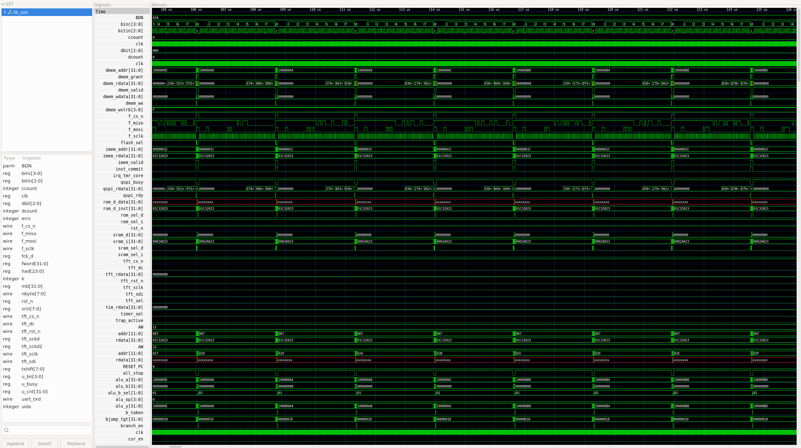
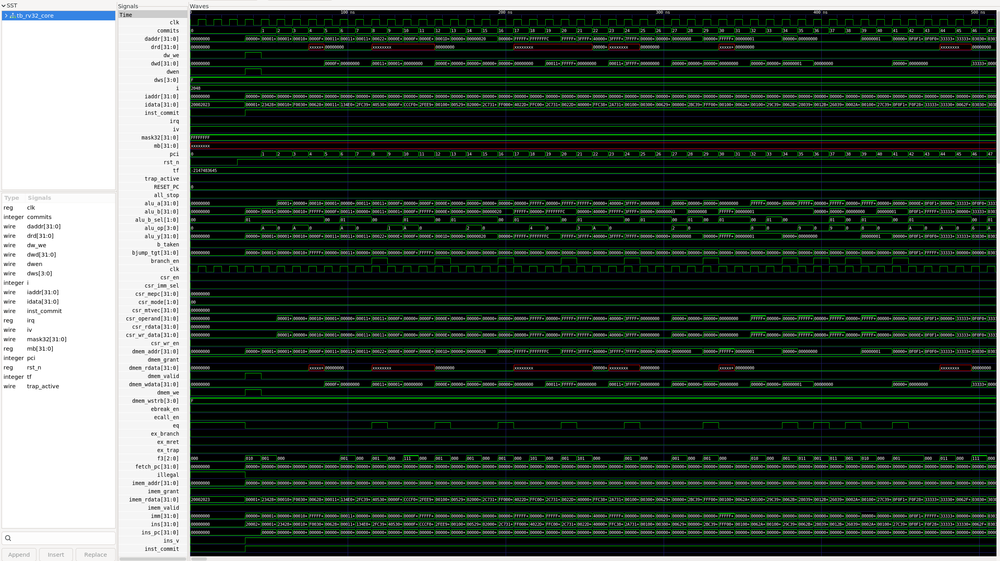
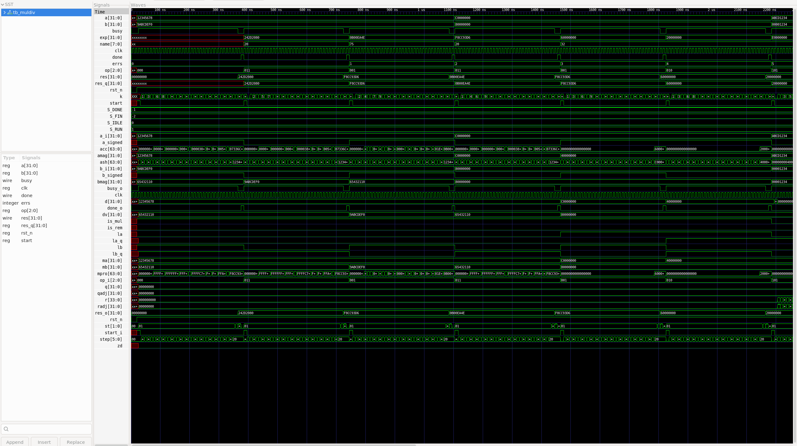

# riscv_doom_soc

**RISC-V SoC (RV32IM)** — an open, synthesizable system-on-chip with a **DOOM-compatible
platform**, verified in simulation and taken through a **complete RTL→GDS-II physical
sign-off** on **SkyWater 130 nm (`sky130_fd_sc_hd`)** via **OpenLane 2**.

- **Track B** — full sign-off exercise (no physical fab submission assumed)
- Language: **Verilog-2001** · Toolchain: iverilog, GNU `riscv64-unknown-elf`,
  Yosys, OpenROAD, Magic, Netgen, KLayout

## Highlights

- ✅ **RV32IM 2-stage core** — M-extension mul/div, CSR + trap/mret, IRQ handling;
  self-checking testbenches all PASS (`RESULT: PASS`, `MULDIV UNIT TEST: PASS`).
- ✅ **SoC integration** — BootROM, 32 KB SRAM, QSPI-flash XIP, **PSRAM window**,
  SPI-TFT (ILI9341) + **pixel-DMA**, UART, mtime/mtimecmp timer + IRQ; verified
  end-to-end (`SOC TEST: PASS`, `QSPI UNIT TEST: PASS`, `TFT_DMA: OK`).
- ✅ **FPGA-ready sync-BRAM** — `fpga/sram_dp_sync.v` + core `if_stall` (ECP5
  EBR-inferable; default async path still PASS).
- ✅ **Software stack + DOOM platform** — crt0, linker script, platform HAL,
  `doomgeneric` bindings built with the GNU RISC-V toolchain.
- ✅ **Phase 5: full GDS-II sign-off on Sky130 via OpenLane 2** — flow complete,
  dual-engine DRC/LVS clean, **timing met** on nominal; **25 ns corner run closes
  the slow corner to −0.07 ns** (see `reports/PHASE5_STATUS.md`).
- 📄 Plans (gated): OpenRAM macro integration, pad ring, Cadence import, DOOM
  glue — see `docs/`.
- ✅ Conference-style project paper: `reports/RISC-V SoC.pdf`.

## Visuals (screenshots)

### GDS-II die view (whole chip, 522.5 × 533.2 µm)


*Rendered by `open/gds2png.py` from the OpenLane 2 GDS-II stream-out.*

### GDS-II die view (zoomed core region)


### Waveforms (simulation, Icarus Verilog → GTKWave)

| Waveform | Source run | Suggested file |
|---|---|---|
| Core smoke: PC trace + IRQ + mailbox | `make run` → `sim/smoke.vcd` | `docs/media/waveform_smoke.png` |
| Full SoC boot: QSPI flash → SRAM → app/UART/TFT/IRQ | `make -C sim soc` → `sim/soc.vcd` | `docs/media/waveform_soc.png` |
| M-extension: mul/div golden vectors | `tb/tb_muldiv.v` → `sim/muldiv.vcd` | `docs/media/waveform_muldiv.png` |







## Phases

| Phase | Status | Deliverables |
|---|---|---|
| 0 Architecture & budget | ✅ | `docs/PHASE0_ARCHITECTURE.md`, `reports/PHASE0_STATUS.md` |
| 1 RV32IM core + M + TBs | ✅ | `rtl/rv32/*.v`, `tb/tb_rv32.v`, `tb/tb_muldiv.v`, `tests/smoke.S`, `reports/PHASE1_STATUS.md` |
| 2 SoC integration | ✅ | `rtl/soc/*.v`, `rtl/periph/*.v`, `tests/boot.S`, `tests/app.S`, `tb/tb_soc.v`, `reports/PHASE2_STATUS.md` |
| 3 doomgeneric platform (SW) | ✅ core / ⏳ engine | `sw/` (crt0, linker, HAL, C demo → **SOC PASS**), vendored `sw/doomgeneric`, `reports/PHASE3_STATUS.md` |
| 4 FPGA bring-up | ⏳ tooling ready, board pending | `fpga/ecp5/` (flows, scripts), `reports/PHASE4_STATUS.md` |
| 5 OpenLane 2 sign-off | ✅ done (DRC/LVS/STA clean) | `open/artifacts/*.gds`, `open/`, `reports/PHASE5_STATUS.md`, `reports/RISCV_SOC_PAPER.pdf` |
| 6 Pad ring | ⏳ (Track-A gated) | — |
| 7 Cadence import | ⏳ | — |

## Memory map (target, locked in Phase 0)

- `0x0000_0000` BootROM (4 KB logic)
- `0x0001_0000` On-chip SRAM 32 KB (OpenRAM macro target)
- `0x1000_0000` QSPI-PSRAM window 8 MB (code+data+logical framebuffer)
- `0x2000_0000` QSPI-flash XIP window
- `0x4000_0000` QSPI controller regs
- `0x4001_0000` SPI-TFT (ILI9341) + pixel DMA
- `0x4002_0000` UART
- `0x4003_0000` Timer (mtime/mtimecmp) + IRQ

## Requirements

- WSL2 (Kali or any Debian-family) with: `iverilog 12+`, `gtkwave`,
  `gcc-riscv64-unknown-elf` (+ binutils), `python3`.
- Docker Desktop (later phases: OpenLane 2 image).

## Build & run (inside WSL2)

```sh
cd /mnt/c/Users/tosha/Downloads/RiscV
make run            # (from root: delegates) Phase-1 core smoke   -> RESULT: PASS
make -C sim waves   # GTKWave on sim/smoke.vcd
make -C sim soc     # Phase-2 SoC end-to-end          -> SOC TEST: PASS
make -C sim qspi    # QSPI engine unit test           -> QSPI UNIT TEST: PASS
```

Expected output:

```
RESULT: PASS   mailbox=0x600df00d irq_count=1 commits=1107
```

M-extension unit test:

```sh
iverilog -g2005 -I rtl/rv32 -o /tmp/md.vvp rtl/rv32/rv32_muldiv.v tb/tb_muldiv.v
vvp /tmp/md.vvp    # -> MULDIV UNIT TEST: PASS
```

## RTL layout

```
rtl/rv32/             core (Phase 1)
rtl/soc/              SoC glue + boot ROM (Phase 2)
rtl/periph/           UART/timer/QSPI/TFT (Phase 2)
tb/                   iverilog testbenches
tests/                RISC-V asm bootloader/app + bin2hex.py
sw/                   Phase-3 software: crt0, linker, platform HAL, demo
sim/                  Makefile, vcds, trace
docs/ reports/        docs and phase status reports
open/                 OpenLane 2 sign-off artifacts + scripts
```

## OpenLane 2 / sky130 sign-off results (Phase 5)

The tractable probe (`SRAM_AW=2`) completed the **full Classic flow (Flow complete.)**:

| Metric | Value |
|---|---|
| Standard cells | 18,267 |
| Die (bbox) | 522.5 × 533.2 µm (0.28 mm²) |
| Utilization | 60.9 % |
| Power | 8.29 mW |
| Setup slack (nom TT) | +8.84 ns — WNS=0, TNS=0, vio=0 |
| Hold slack | +0.29 ns — WNS=0, TNS=0, vio=0 |
| DRC (Magic / KLayout) | 0 / 0 |
| LVS (Netgen) | 0 dev / 0 nets (PASS) |
| Wirelength / vias | 698,942 µm / 124,148 |

Full synthesis (`SRAM_AW=9`): **68,690 cells**, **0.916 mm²** (43% sequential), through
CTS (1,952 clock subnets) and STA with WNS=0. See `reports/PHASE5_STATUS.md` and the
final paper `reports/RISC-V SoC.pdf`. 

## Open-source notes

- This repository is a self-contained study (Track B): **no physical fab submission assumed**.
- Third-party components (`doomgeneric`, SkyWater PDK, OpenLane 2, etc.) belong to their authors.
